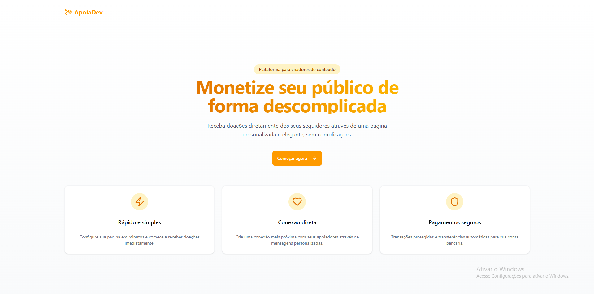
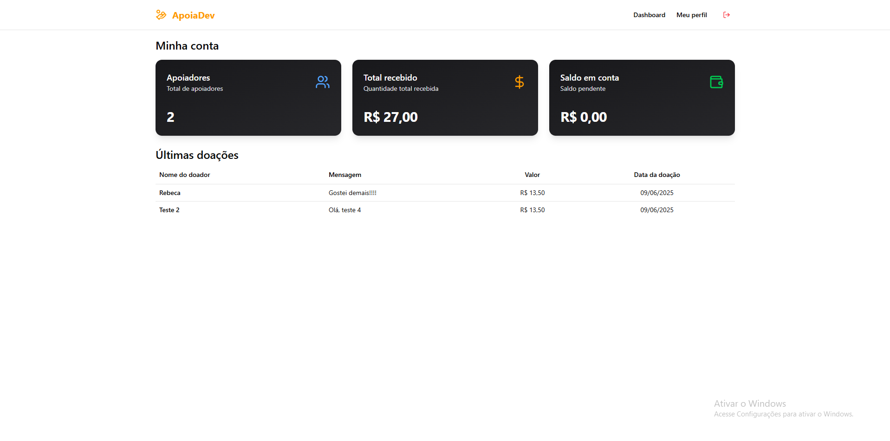
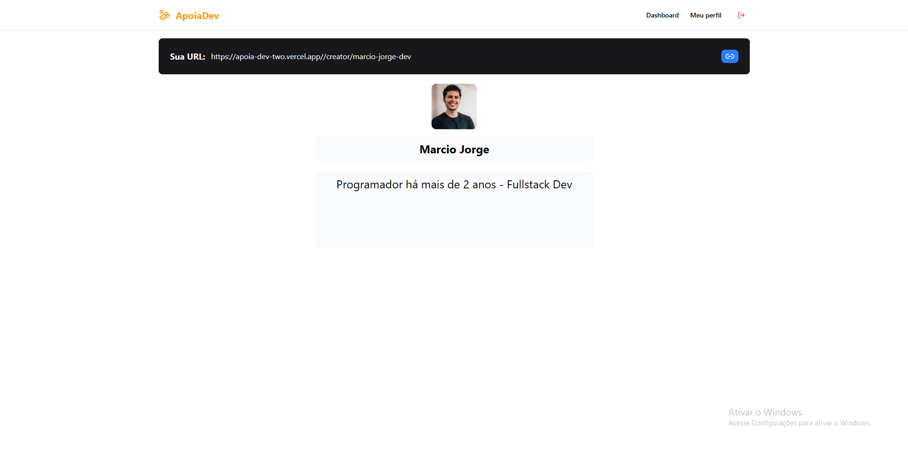
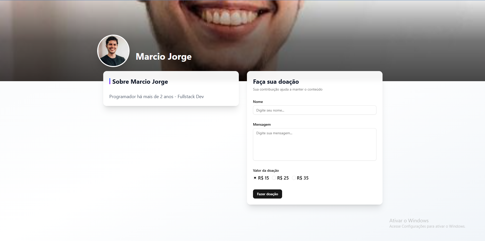
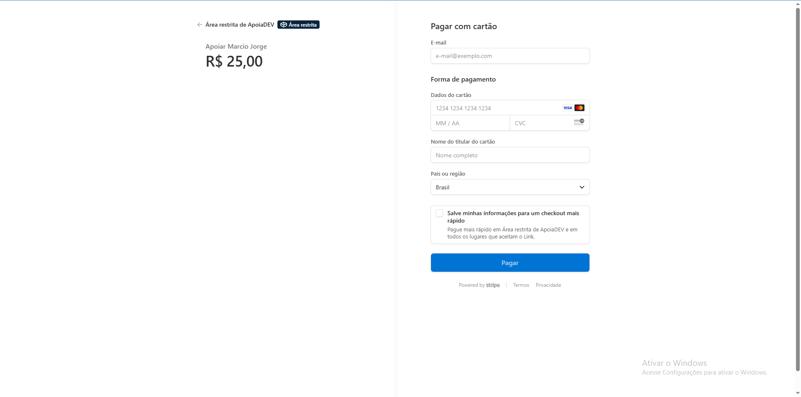
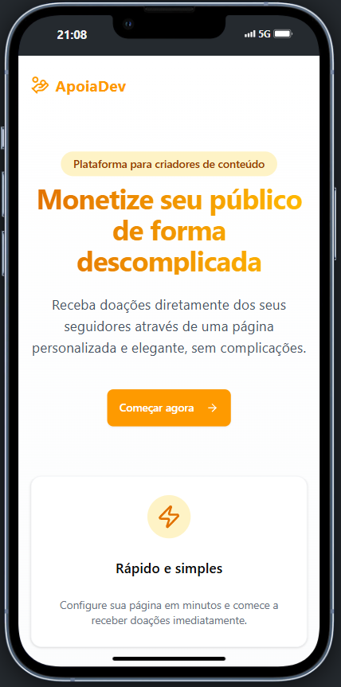
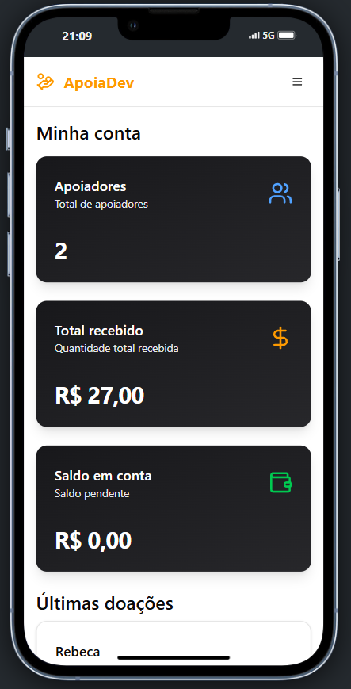
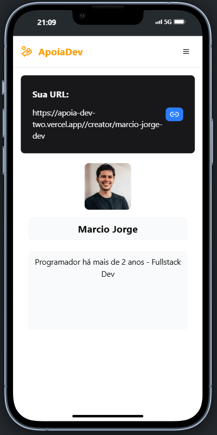
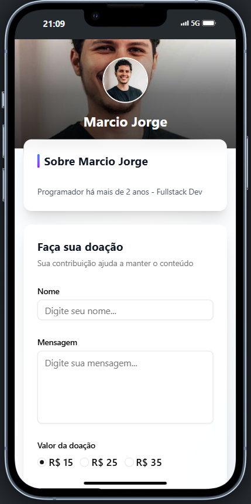

# ApoiaDev



O **ApoiaDev** é uma aplicação SaaS desenvolvida para fortalecer o vínculo entre criadores de conteúdo e seus apoiadores, oferecendo uma forma moderna, segura e escalável de receber e acompanhar doações. Com ele, criadores podem configurar seu perfil público, disponibilizar conteúdos especiais para apoiadores, acompanhar receitas em tempo real, além de personalizar planos de apoio e se conectar de forma mais próxima com sua comunidade.

Desenvolvido com tecnologias modernas como Next.js, Tailwind CSS e TypeScript, o sistema conta com uma área administrativa completa, login com GitHub via NextAuth, e integração com a Stripe para gerenciamento de assinaturas recorrentes. A persistência de dados é feita com Prisma ORM e Neon Postgres, garantindo performance e segurança, enquanto todo o sistema é pensado para ser responsivo, com visual moderno e fácil de usar tanto por criadores quanto apoiadores.

## Sumário

1. [Visão Geral do Projeto](#visão-geral-do-projeto-funcionalidades-principais)
   - [Acompanhamento em tempo real de dados](#1-acompanhamento-em-tempo-real-de-dados)
   - [Gerenciamento de seu perfil público para seus apoiadores](#2-gerenciamento-de-seu-perfil-público-para-seus-apoiadores)
   - [Página pública para receber doações](#3-página-pública-para-receber-doações)
   - [Pagamento totalmente integrado com o sistema](#4-pagamento-totalmente-integrado-com-o-sistema)
2. [Tecnologias Utilizadas](#tecnologias-utilizadas-linguagens-e-ferramentas)
3. [Estrutura do Projeto](#estrutura-do-projeto)
5. [Screenshots](#screenshots)
   - [Web](#web)
   - [Mobile](#mobile)
6. [Requisitos para Rodar o Projeto Localmente](#requisitos-para-rodar-o-projeto-localmente)
7. [Rodar o Projeto Localmente](#rodar-o-projeto-localmente)
8. [Autores](#autores)
9. [Licença](#licença)

## Visão Geral do Projeto (Funcionalidades Principais)

### 1. Acompanhamento em tempo real de dados:

  Acompanhamento de dados importantes para o criador como:

  - Quantidade de apoiadores
  - Total recebido
  - Saldo em conta para retirada
  - Últimas doações (Com nome, mensagem, valor e data da doação)

### 2. Gerenciamento de seu perfil público para seus apoiadores:

  Realiza o gerenciamento de seu perfil online, como: 

  - Domínio interno
  - Nome
  - Descrição

### 3. Página pública para receber doações:

  Página pública para acesso de apoiadores, para conhecer seu criador e poder apoia-lo mandando:

  - Nome
  - Mensagem
  - Valor da doação

### 4. Pagamento totalmente integrado com o sistema:

  Sistema de pagamento integrado com as opções da aplicação, com o valor selecionado no formulário sendo levado, junto ao apoiador, para a interface de pagamento da Stripe

## Tecnologias Utilizadas (Linguagens e ferramentas)

<table>
    <tr>
      <td align="center">
        <a href="https://nextjs.org/">
          
          <br />
          <sub>
            <b>Next.JS</b>
          </sub>
        </a>
      </td>
      <td align="center">
        <a href="https://tailwindcss.com/">
          
          <br />
          <sub>
            <b>Tailwind</b>
          </sub>
        </a>
      </td>
      <td align="center">
        <a href="https://www.typescriptlang.org/">
          
          <br />
          <sub>
            <b>TypeScript</b>
          </sub>
        </a>
      </td>
    </tr>
</table>
<table border-style="none">
  <tr>
    <td align="center">
      <a href="https://www.postgresql.org/">
        <br />
        <sub>
          <b>Postgres</b>
        </sub>
      </a>
    </td>
    <td align="center">
      <a href="https://www.prisma.io/?via=start&gad_source=1&gclid=CjwKCAiAh6y9BhBREiwApBLHC9l2TMrWhYJPi787DeRP5SCnQp6MnosFLDKIvTfWJ9IoUl684SdROhoCrTUQAvD_BwE">
        <br />
        <sub>
          <b>Prisma</b>
        </sub>
      </a>
    </td>
    <td align="center">
      <a href="https://neon.tech/">
        <br />
        <sub>
          <b>Neon-Postgres</b>
        </sub>
      </a>
    </td>
    <td align="center">
      <a href="https://git-scm.com/">
        <br />
        <sub>
          <b>Git</b>
        </sub>
      </a>
    </td>
  </tr>
</table>

## Estrutura do Projeto

O projeto é organizado em vários arquivos para melhor organização do código e separação de interesses:

- `src/app`: É a pasta responsável pelas páginas da aplicação;
- `src/components`: É a pasta responsável pela organização dos componentes globais da aplicação;
- `src/lib`: É a pasta responsável pela configuração de serviços externos usados no projeto;
- `src/providers`: É a pasta responsável pelo provider, que no caso, é o react-query utilizado na aplicação;
- `src/utils`: É a pasta responsável por funcionalidades úteis em todo o projeto;

## Screenshots

### Web
#### Home

#### Dashboard

#### Conta do criador

#### Perfil público

#### Pagamento


### Mobile
#### Home

#### Dashboard

#### Conta do criador

#### Perfil público


## Requisitos para Rodar o Projeto Localmente

### Node.js e npm:

- Verifique se você tem o Node.js instalado. Caso contrário, faça o download e instale a versão mais recente do Node.js.
- O npm (Node Package Manager) é instalado automaticamente com o Node.js.

### Git:

- Certifique-se de ter o Git instalado em sua máquina. Se não tiver, você pode baixá-lo aqui.

### Editor de Texto ou IDE:

- Escolha um editor de texto ou uma IDE (Ambiente de Desenvolvimento Integrado) para trabalhar no código. Alguns exemplos populares incluem o Visual Studio Code, Sublime Text e Atom.

### Navegador Web:

- Você precisará de um navegador web para visualizar o aplicativo localmente. Recomendamos o uso do Google Chrome, Mozilla Firefox ou Microsoft Edge.

### Configuração dos sistemas externos:

- Necessita realizar toda a configuração do Prisma e Neon-Postgres.

## Rodar o Projeto Localmente

**Clone o projeto**

```bash
  git clone https://github.com/MarcioJorgeMelo/apoia-dev.git
```

**Vá para a pasta do projeto**

```bash
  cd apoia-dev
```

**Abra o projeto no VSCode**

```bash
  code .
```

**Instale as dependências**

```bash
  npm install # Instala as dependências (se ainda não tiver feito)
```

**Rode o projeto**

```bash
  npm run dev
```

## Autores

- [@MarcioJorgeMelo](https://github.com/MarcioJorgeMelo)

## Licença

- [MIT](https://choosealicense.com/licenses/mit/)
